Welcome to the user guide for BB 21st Portal.  

BB 21st Portal is a website designed for **Officers and Primers** to facilitate administrative workflow.   
It currently supports the following features:  
1. generating 32a results in PDF format through a simplified form  
2. conducting uniform inspections  
3. creating feedback forms/quizzes (functions like Google Forms)  
[example]: 4. tracking of key awards for Boys  

Refer to the `Features` section on the features that are available for use and how to use them.  

If you run into any issues using the website try checking through the `Known Issues` sections to see if the issues has already been brought up and there are any known solutions.  

* Table of Contents
{:toc}

--------------------------------------------------------------------------------------------------------------------

## Features

### User Management

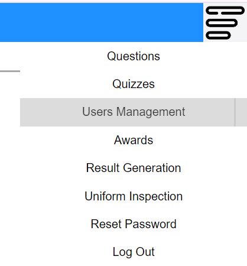

Click on the menu on the top right and select `Users Management` to view and manage all accounts.

You will see the page with a list of existing accounts on the left and a form to create new accounts on the right.

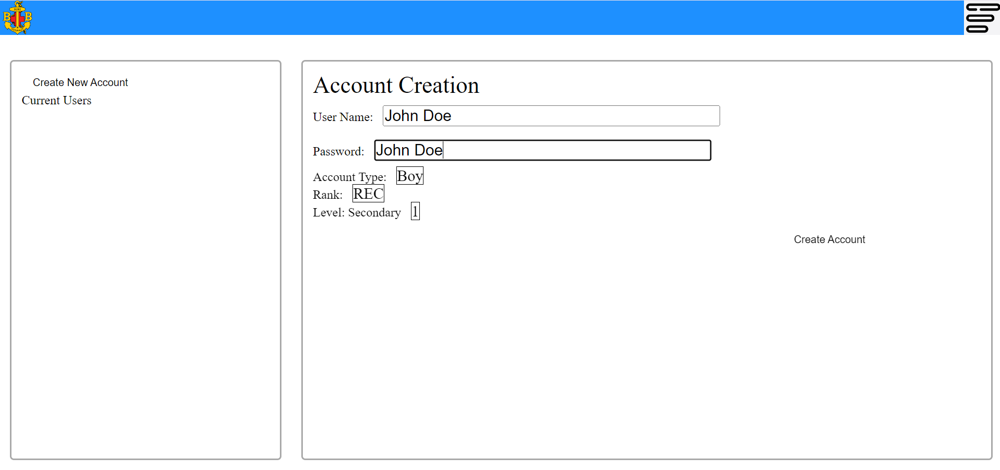

#### Creating a New Account

Fill in the form to create a new account, after creating the account it will appear on the list on the left as seen below.

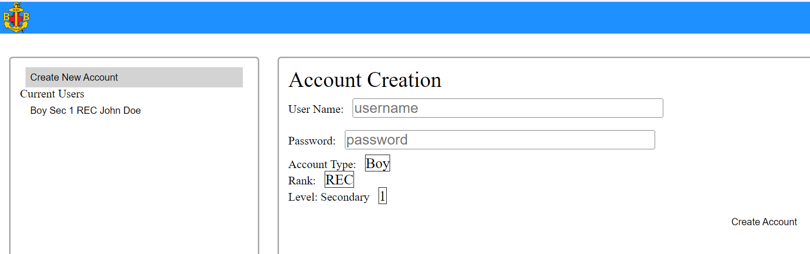

#### Updating an Existing Account

To update the information of an existing account, click on the account on the list on the left. It will show the information of the account selected as seen below.

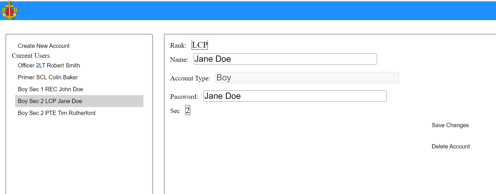

Simply edit the information as necessary and click on `Save Changes` to update the account.

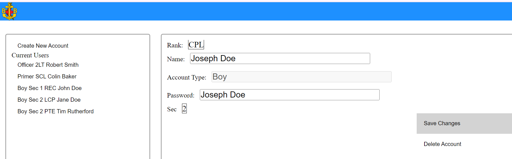

After clicking on `Save Changes`, the changes made will be reflected on the list as seen below.

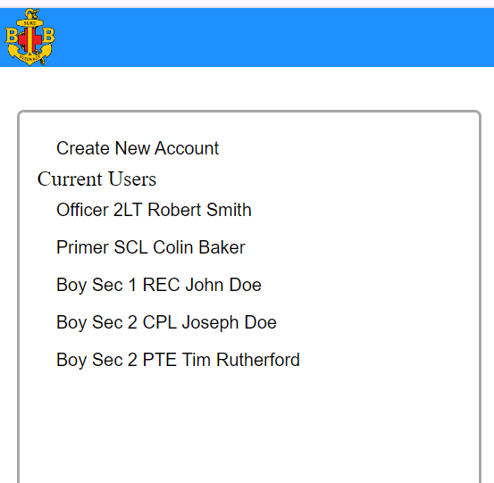

#### Deleting an Existing Account

To delete an account, select the account from the list and click on `Delete Account`.

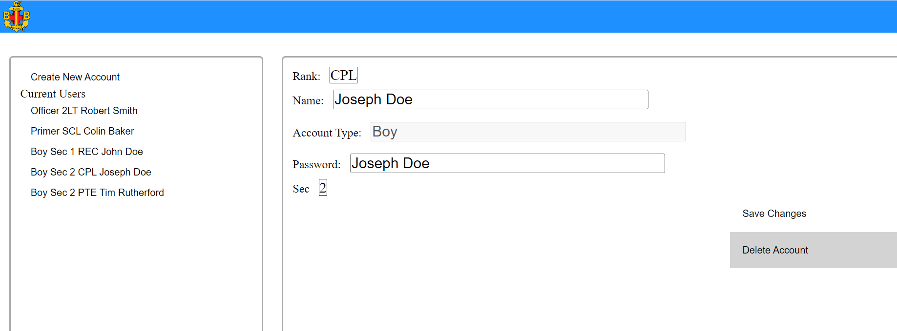

After clicking on `Delete Account`, the account will be removed on the list as seen below.

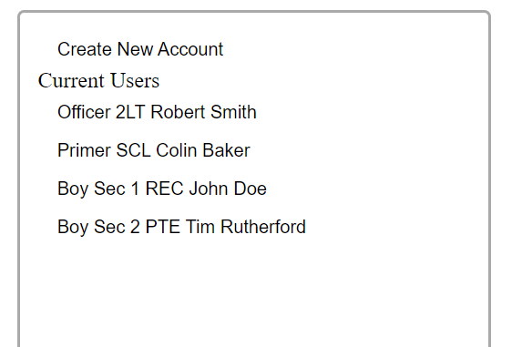

### Awards Management

#### Generating Results for 32A

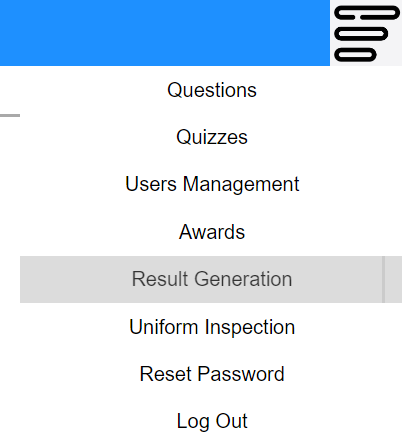

Click on the menu on the top right and select `Result Generation` to generate results for 32A form submission.

You will see a form with some drop down menus for you to fill in. Select both an award and a instructor/assessor.

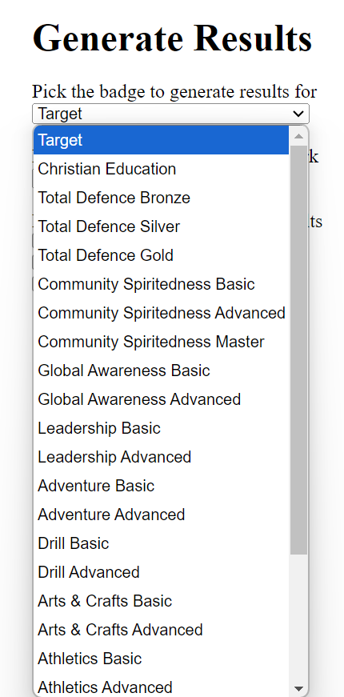

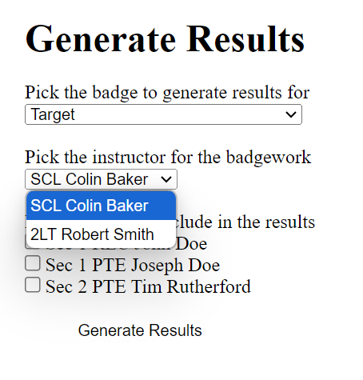

Afterwhich, select the boys who are passing the award.

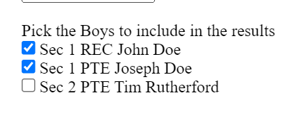

Certain awards could require you to fill in additional information as shown below.

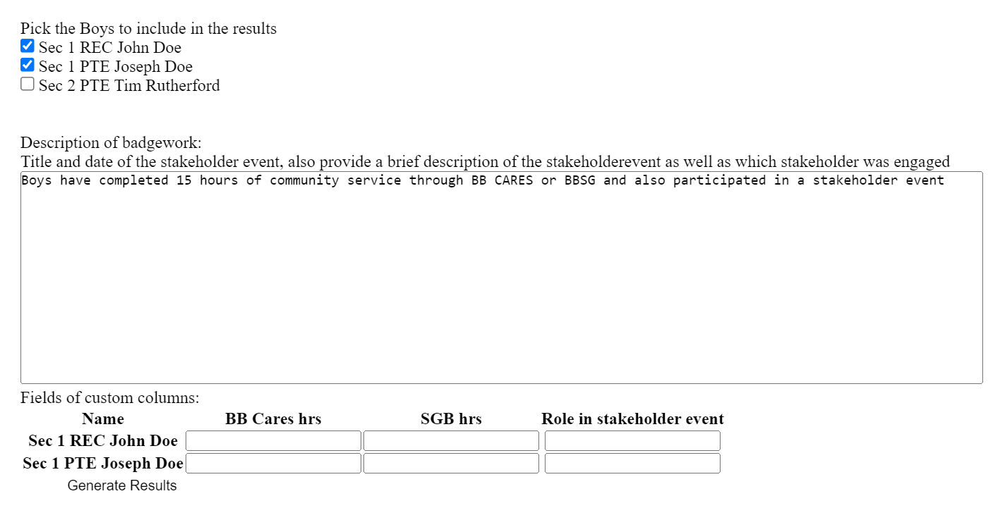

Fill in all the empty fields before generating the results

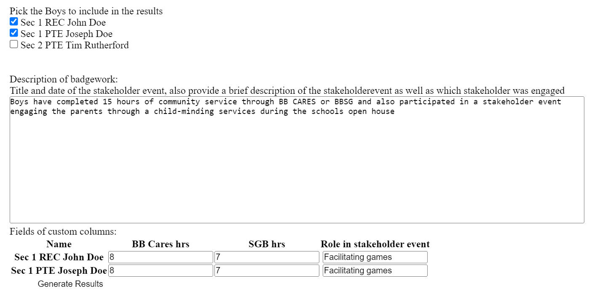

Click on `Generate Results` to generate the PDF copy of the results.

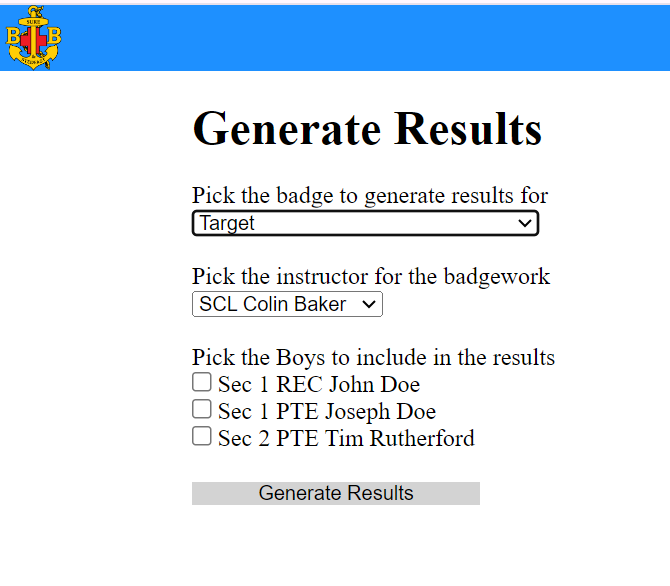

After clicking on `Generate Results`, you will see the PDF version which can be downloaded.

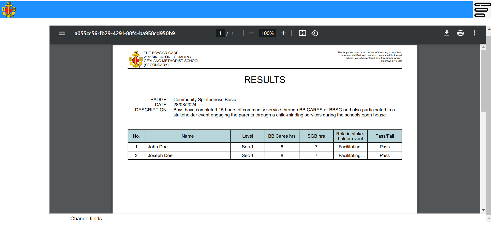

Click on the `Change fields` button to go back to the form to edit any information.

### Uniform Inspection

#### Conducting Uniform Inspection

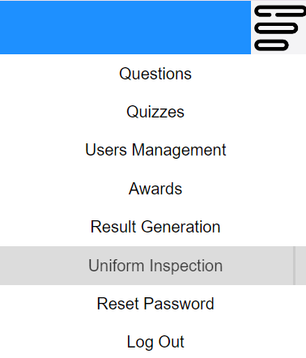

Click on the menu on the top right and select `Uniform Inspection` to conduct uniform inspections.

You will see a page where boys and their previous recorded inspection scores are listed.

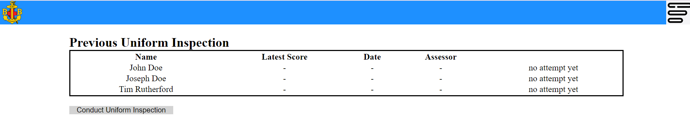

Click on the `Conduct Uniform Inspection` button to start conducting an inspection.

You will be brought to a form where you can select the Boys to be inspected and fill in the inspection fields for each Boy.

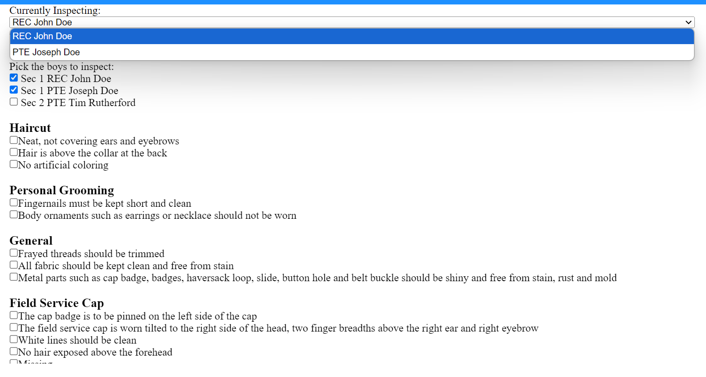

You can select the Boys that will be inspected through the checkbox. Once the Boys have been ticked off, their names will be included in the drop down box at the top of the form.

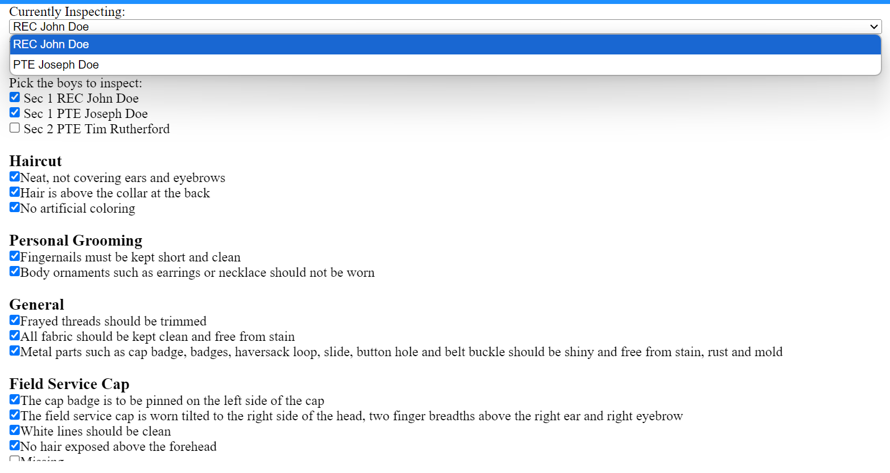

At any point of the inspection use the drop down box at the top to swap between the Boys. Swapping to another Boy will not remove the form filled out for the previous Boys.

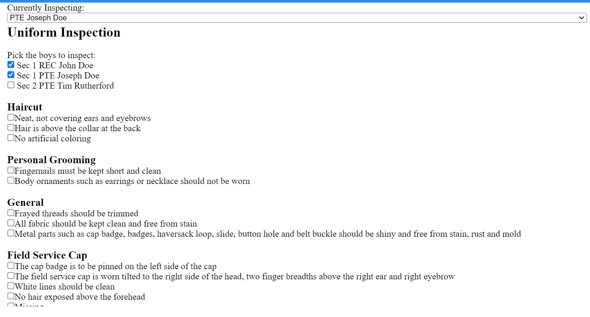

As shown above, after swapping to another Boy the form will reset itself to a copy for this Boy.

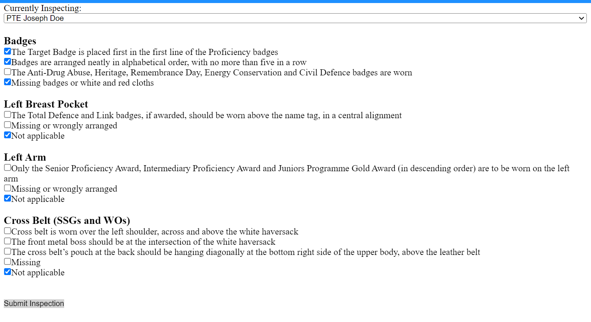

Only submit the form once, after filling it up for every selected Boy.

After submitting the form, you will be able to see the results. Note how the boys both have differenet scores even though the form was submitted together. The Boys do not share the same form, you have to swap between the Boys when filling up the form.

### Creating Forms / Assessments

Create and conduct tests / forms for Boys to fill in. This features are a work in progress.

--------------------------------------------------------------------------------------------------------------------

[example]: ## FAQ

[example]: --------------------------------------------------------------------------------------------------------------------

## Known Issues

**There are currently no known issues!**

[example]: 1. **When trying to generate results**, you are unable to do so if there are no primers in the list of users.